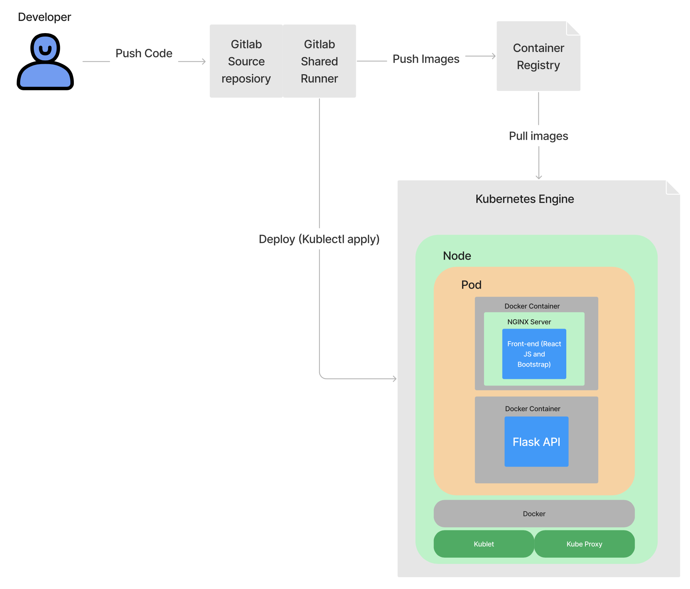

# CIS3760 - Group 203

# **You can access our production server at https://35.237.83.181**

## Overview

Our scheduler app allows the user to create a class schedule using data sourced from UofG's WebAdvisor. By searching for a course name, section name, or parts of either, the site will show all options containing the included keywords. These keywords can be separated by a semicolon to find the union of the keywords on both sides. The user can click view departments to sort the courses by their course departments rather than using the search function. Once these classes are selected, they can be deselected by clicking on them on either the list of selected courses, or by clicking on them on the calendar itself. The exam schedule for these courses can be viewed with the "View Exam Schedule" button, and the site can go between light and dark mode with the button below the calendar. The semester can be changed using the arrow keys above the calendar. Instructions for the setup can be viewed below.

## Tech

**Frontend**

- React
- Bootstrap
- Axios
- Hosted behind NGINX

**Backend**

- Flask (used as REST API)
- Hosted behind Gunicorn

## Running locally

In order to run the stack locally, you must have Docker and docker-compose installed and configured.

If you are on a modern flavor of Linux, you can run the `install.sh` script in the project base. This will install and configure Docker + docker-compose

**To bring up the project, run:**

```
docker-compose up
```

This will build the `app`, `api`, and `db` containers, and run them in the foreground (you can append the `-d` flag to run in daemon mode)

You can access the frontend at https://localhost. The Flask API can be reached at http://localhost:3001/api.

**Seeding the database:**

When running the project locally for the first time, you must seed the database
so that it is populated with course information. Run the following:

```
cd scripts
pip3 install -r requirements.txt
chmod 755 htmlparser seed_db
python3 htmlparser data/f22.html --create-seed f22
python3 htmlparser data/w23.html --create-seed w23
python3 seed_db
```

**To bring down the project, run:**

```
docker-compose down
```

If the stack is running in the foreground, Ctrl+C will work as well.

**To rebuild the project, run:**

```
docker-compose build
```

## Production Environment



Our app is externally hosted using Google Cloud Platform's Kubernetes Engine. We also utilize GitLab Runners to build and package our images, and move them to Container Registry for storage. From there, the deployment is triggered by a GitLab pipeline task and the Kube master node automatically revises the cluster.

You can access our production server at https://35.237.83.181
